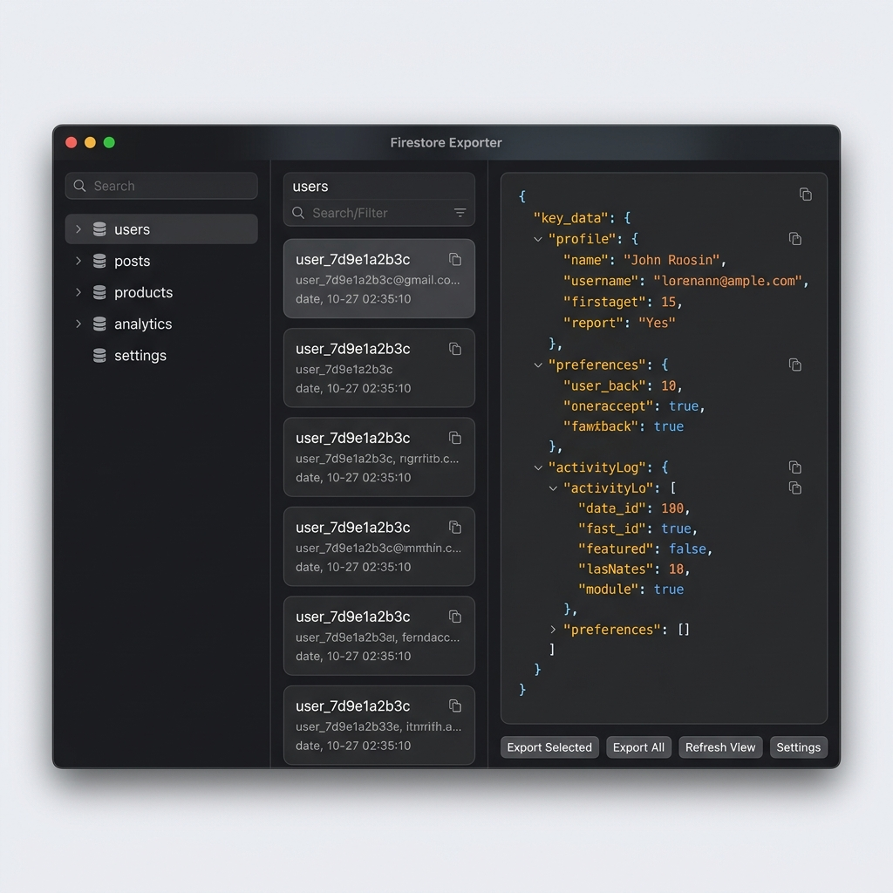

# Firestore Exporter



Firestore Exporter is a public, zero-friction, cross-platform desktop application designed to connect to both your local **Firebase Emulator Suite (Firestore)** and **Live Cloud Firestore (Production / Staging / Development)** databases. It enables developers to visually explore emulator and production databases, analyze nested structures, and export data as perfectly formatted JSON with a single click.

Styled with a premium, dark-themed **Windows 11 Fluent UI (WinUI)** layout, the app features dynamic platform adaptations to look and feel completely native across **Windows**, **macOS**, and **Linux**.

---

## ✨ Features

*   **Platform-Aware Aesthetics:**
    *   **Windows:** Implements native frameless Mica style sheets and window controls overlay integrations.
    *   **macOS:** Automatically offsets navigation bars to perfectly position standard traffic light controls.
    *   **Linux:** Integrates seamlessly into default Gtk/system window decoration frames to prevent missing button controls.
*   **Dual Connection Gateways:**
    *   **Local Emulator Suite:** Auto-scans common local ports (`8080`, `8085`, `8081`, `8082`, `9000`, `3000`) using low-level TCP socket pings to connect in seconds.
    *   **Live Cloud Firestore:** Connects securely to production, staging, or development instances using Google Service Account credentials, keeping configurations local and context-isolated.
*   **Triple-Pane Workspace:**
    *   **Collections Navigation:** Real-time schema lists with fuzzy-search filtering and standard sidebar accent pills.
    *   **Documents Explorer:** Displays document collections and document paths with click-to-copy IDs.
    *   **Data Analyzer:** Premium collapsible JSON tree viewer with developer-themed syntax highlighting. Correctly serializes complex Firestore types like `Timestamp`, `GeoPoint`, and `DocumentReference`.
*   **Single-Click Native Exports:** Spawns native system save dialogs to export an **Entire Database**, **Single Collection**, or **Individual Document** into perfectly formatted JSON files.

---

## 🏗️ Project Monorepo Structure

Built using **Turborepo** and **pnpm** for rapid compilation and modular scaling:
*   **`packages/core`:** Pure Node.js & Firebase Admin SDK crawler engine that recursively parses emulator database hierarchies.
*   **`packages/ui`:** Fluent React component library (Mica cards, micro-interaction buttons, bottom-accent inputs, and toast alerts).
*   **`apps/desktop`:** Cross-platform Electron shell bundled with Vite and React. Exposes secure, context-isolated IPC channels.

---

## 🚀 Getting Started (Development Mode)

### Prerequisites
Make sure you have [Node.js](https://nodejs.org/) (v18+) and [pnpm](https://pnpm.io/) installed.

```bash
npm install -g pnpm
```

### 1. Installation
Clone the repository and install all workspace dependencies from the root directory:
```bash
pnpm install
```

### 2. Run the App
Launch the simultaneous development servers (Vite React HMR + Electron main watch):
```bash
npx pnpm dev
```
The app window will automatically open, connected to the live compiler.

---

## 📦 Building & Packaging for Production

Production binaries are packaged using **`electron-builder`**. All generated installer files are output directly to `apps/desktop/dist-packaged/`.

> [!WARNING]
> **Do not run `electron-builder` directly via `exec`.**
> Running `electron-builder` without first building the static resources will result in an incomplete package (missing the compiled `dist/renderer` folder), which causes the application to launch with a blank screen. Always use the pre-configured `dist` scripts shown below to ensure the frontend assets and main process scripts are properly built before packaging.

To compile the monorepo and package the application for your **current host system**, run the following command from the root directory:
```bash
pnpm --filter firestore-exporter-desktop dist
```

### 🖥️ Targeting Specific Platforms

You can target specific platforms using pre-configured workspace distribution scripts:

#### 1. Windows (`.exe` NSIS Installer)
Build a fully bundled Windows installer:
```bash
# Run on a Windows machine
pnpm --filter firestore-exporter-desktop dist --win
```
*   **Output:** `apps/desktop/dist-packaged/Firestore Exporter Setup [version].exe`

#### 2. macOS (`.dmg` Disk Image)
Build a macOS package bundle:
```bash
# Run on a macOS machine
pnpm --filter firestore-exporter-desktop dist --mac
```
*   **Output:** `apps/desktop/dist-packaged/Firestore Exporter-[version].dmg`
*   *Note: Creating macOS installer files requires a macOS machine due to system-level codesign and toolchain requirements.*

#### 3. Linux (`.AppImage` Executable)
Build a portable Linux app:
```bash
# Run on Linux or WSL
pnpm --filter firestore-exporter-desktop dist --linux
```
*   **Output:** `apps/desktop/dist-packaged/Firestore_Exporter_[version].AppImage`

---

## ☁️ Uploading to GitHub Releases

To share your compiled executables on GitHub:

1.  **Run the production builds** on Windows, Mac, and Linux machines to generate the respective `.exe`, `.dmg`, and `.AppImage` files.
2.  Go to your GitHub Repository page.
3.  Click on **Releases** -> **Draft a new release**.
4.  Choose a tag version (e.g., `v1.0.0`) and title.
5.  Drag and drop the packaged files from `apps/desktop/dist-packaged/`:
    *   `Firestore Exporter Setup 1.0.0.exe`
    *   `Firestore Exporter-1.0.0.dmg`
    *   `Firestore_Exporter_1.0.0.AppImage`
6.  Click **Publish release**! Your users can now download and run the native apps on any platform.
